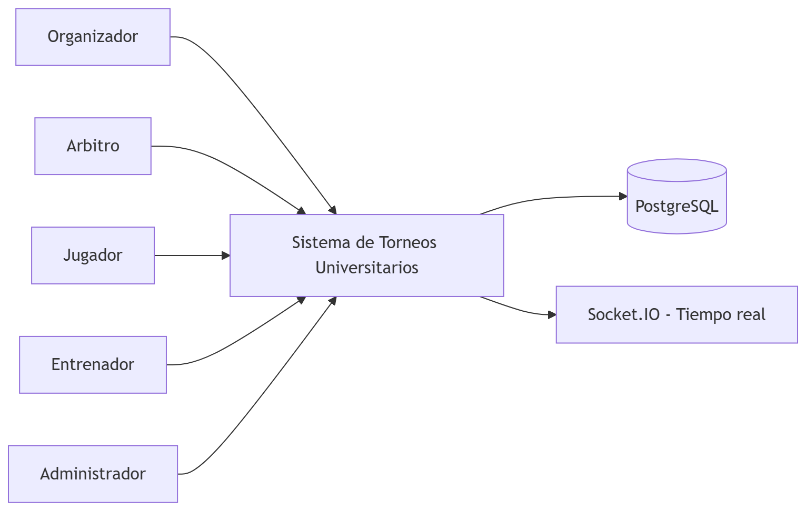
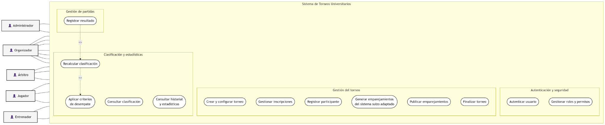
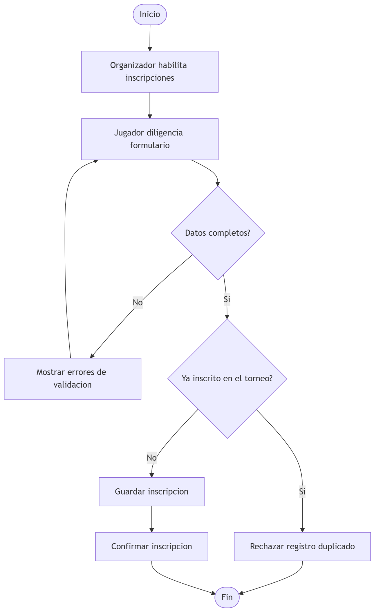
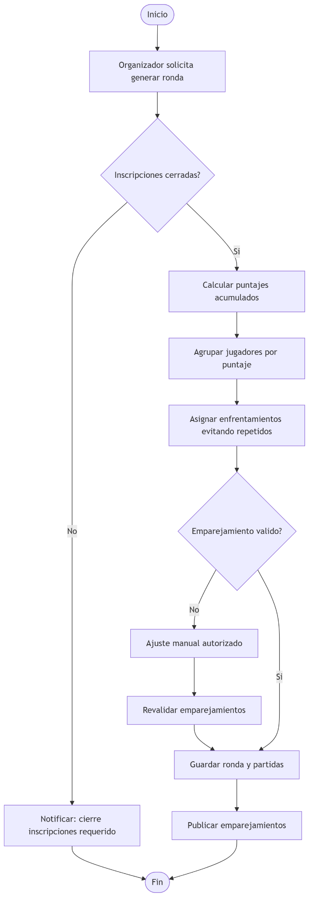
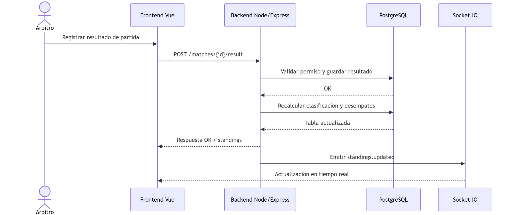
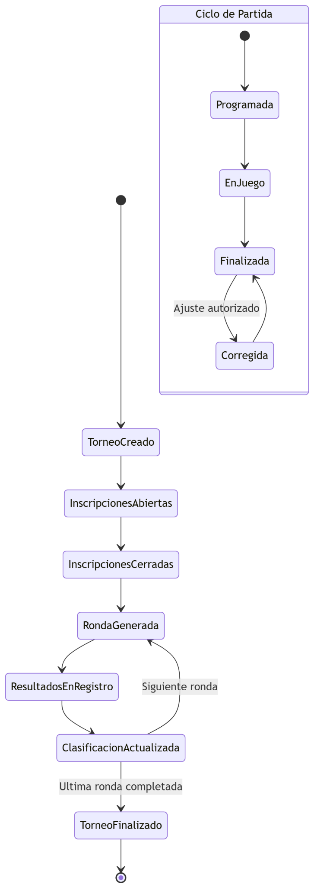
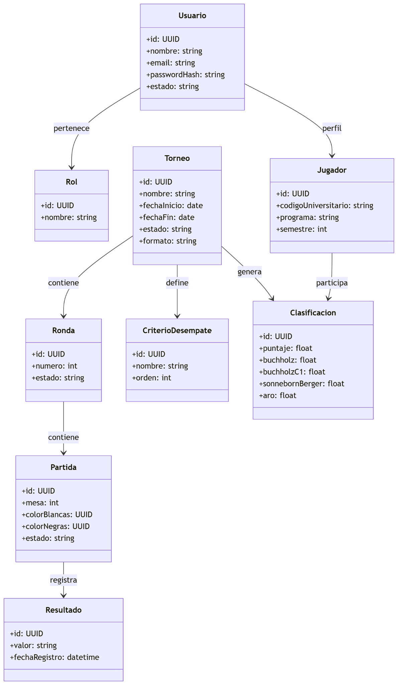
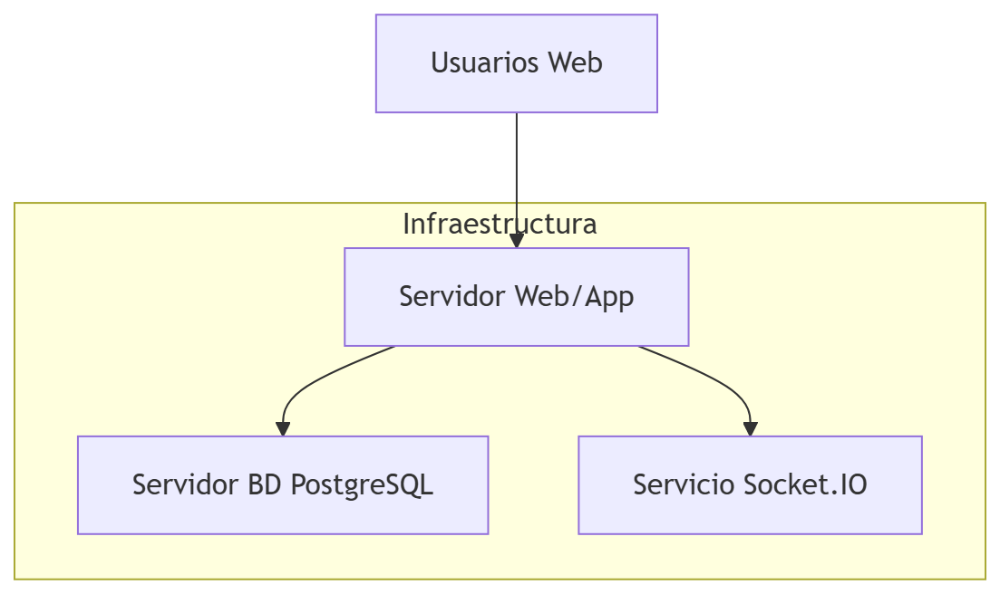
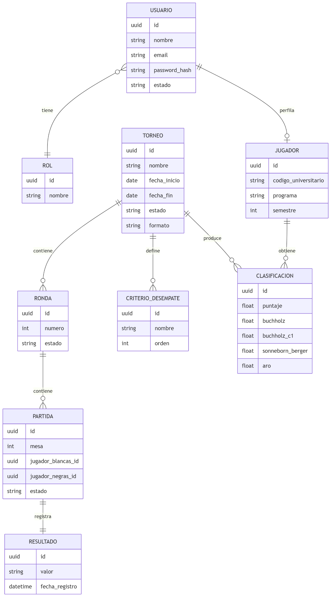

# Torre Central Hub

**Sistema de Gestión de Torneos de Ajedrez Universitarios**

Documento de sustentación — Práctica de Ingeniería IV

Universidad Central · Facultad de Ingeniería y Ciencias Básicas

**Autor:** Nilson Aldair Molina Rengifo

**Fecha:** Agosto de 2026

---

## Tabla de contenido

- [Resumen](#resumen)
- [Abstract](#abstract)
- [Introducción](#introducción)
- [Delimitación, supuestos y restricciones](#delimitación-supuestos-y-restricciones)
  - [Delimitación](#delimitación)
  - [Supuestos](#supuestos)
  - [Restricciones](#restricciones)
- [Planteamiento del problema](#planteamiento-del-problema)
- [Justificación](#justificación)
  - [Relevancia](#relevancia)
  - [Pertinencia](#pertinencia)
  - [Impacto](#impacto)
- [Estado del arte](#estado-del-arte)
  - [Vacío identificado](#vacío-identificado)
- [Pregunta problema](#pregunta-problema)
- [Objetivos del proyecto](#objetivos-del-proyecto)
  - [Objetivo general](#objetivo-general)
  - [Objetivos específicos](#objetivos-específicos)
- [Marco referencial](#marco-referencial)
  - [Marco teórico y conceptual](#marco-teórico-y-conceptual)
    - [Ingeniería de software](#ingeniería-de-software)
    - [Metodología Scrum (adaptación académica)](#metodología-scrum-adaptación-académica)
    - [UML](#uml)
    - [Arquitectura web del sistema](#arquitectura-web-del-sistema)
    - [Dominio ajedrecístico: conceptos diferenciados](#dominio-ajedrecístico-conceptos-diferenciados)
  - [Marco de referencia reglamentaria](#marco-de-referencia-reglamentaria)
- [Tecnologías utilizadas y justificación](#tecnologías-utilizadas-y-justificación)
- [Metodología](#metodología)
  - [Fase 1. Levantamiento y priorización](#fase-1-levantamiento-y-priorización)
  - [Fase 2. Diseño](#fase-2-diseño)
  - [Fase 3. Desarrollo incremental](#fase-3-desarrollo-incremental)
  - [Fase 4. Validación](#fase-4-validación)
- [Desarrollo](#desarrollo)
  - [Especificación de requerimientos](#especificación-de-requerimientos)
    - [Requerimientos funcionales](#requerimientos-funcionales)
    - [Criterios de aceptación funcional](#criterios-de-aceptación-funcional)
    - [Requerimientos no funcionales](#requerimientos-no-funcionales)
    - [Reglas de negocio](#reglas-de-negocio)
  - [Actores del sistema](#actores-del-sistema)
    - [Catálogo ampliado de casos de uso](#catálogo-ampliado-de-casos-de-uso)
    - [Especificación textual de casos de uso críticos](#especificación-textual-de-casos-de-uso-críticos)
      - [UC09 Generar emparejamiento suizo adaptado](#uc09-generar-emparejamiento-suizo-adaptado)
      - [UC11 Registrar resultado de partida](#uc11-registrar-resultado-de-partida)
      - [UC13 Recalcular clasificación](#uc13-recalcular-clasificación)
      - [UC16 Consultar historial de jugador](#uc16-consultar-historial-de-jugador)
      - [UC28 Asignar bye automático](#uc28-asignar-bye-automático)
      - [UC22 Ejercer derechos sobre datos personales](#uc22-ejercer-derechos-sobre-datos-personales)
  - [Historias de usuario](#historias-de-usuario)
  - [Product Backlog y priorización](#product-backlog-y-priorización)
  - [Incrementos funcionales](#incrementos-funcionales)
  - [Definition of Done](#definition-of-done)
  - [Matriz de trazabilidad](#matriz-de-trazabilidad)
  - [Diseño de la solución](#diseño-de-la-solución)
  - [Arquitectura tecnológica](#arquitectura-tecnológica)
    - [Frontend (Vue.js)](#frontend-vuejs)
    - [Backend (Node.js + Express)](#backend-nodejs-express)
    - [Tiempo real (Socket.IO)](#tiempo-real-socketio)
    - [Persistencia (PostgreSQL)](#persistencia-postgresql)
    - [Contratos funcionales de API](#contratos-funcionales-de-api)
    - [Catálogo de eventos en tiempo real (Socket.IO)](#catálogo-de-eventos-en-tiempo-real-socketio)
  - [Modelo de datos](#modelo-de-datos)
    - [Diccionario de datos mínimo](#diccionario-de-datos-mínimo)
    - [Restricciones de integridad](#restricciones-de-integridad)
  - [Clasificación y desempates](#clasificación-y-desempates)
  - [Alcance del sistema](#alcance-del-sistema)
  - [Validación del sistema](#validación-del-sistema)
    - [Plan de pruebas textual](#plan-de-pruebas-textual)
    - [Criterios de salida de validación](#criterios-de-salida-de-validación)
  - [Resultado de la implementación del sistema](#resultado-de-la-implementación-del-sistema)
- [Diagramas del sistema](#diagramas-del-sistema)
- [Conclusiones](#conclusiones)
  - [Riesgos, limitaciones y mitigación](#riesgos-limitaciones-y-mitigación)
    - [Riesgos](#riesgos)
    - [Mitigación](#mitigación)
    - [Fronteras definitivas del dominio](#fronteras-definitivas-del-dominio)
  - [Cumplimiento normativo de datos personales](#cumplimiento-normativo-de-datos-personales)
- [Referencias](#referencias)

---

# Resumen

Este trabajo presenta el diseño e implementación de un sistema de información para la gestión de torneos y campeonatos universitarios de ajedrez en Bogotá. La propuesta aborda problemas operativos frecuentes en la administración manual de competencias, particularmente en inscripción de jugadores, emparejamiento por rondas, registro de resultados y cálculo de clasificación con criterios de desempate. El sistema se desarrolla con un enfoque Scrum adaptado al contexto académico y una arquitectura web basada en Node.js, Express, Vue.js, Socket.IO y PostgreSQL. El alcance del sistema incluye autenticación por roles, configuración de torneo, inscripción, emparejamiento suizo adaptado, registro de resultados, clasificación y aplicación de desempates. Como resultado, se obtiene un sistema completo y validado, con coherencia entre requisitos, modelado, implementación y comportamiento operativo, dentro del dominio funcional definido para la gestión de torneos universitarios de ajedrez.

Palabras clave: torneos universitarios, gestión de campeonatos, ajedrez, sistema suizo, desempates, Scrum, UML, arquitectura web.

# Abstract

This document presents the design and implementation of a complete information system for university chess tournament management in Bogota. The proposal addresses common operational issues found in manual administration, especially player registration, round pairings, result recording, and standings calculation with tie-break criteria. The system is developed through an academic adaptation of Scrum and a web architecture based on Node.js, Express, Vue.js, Socket.IO, and PostgreSQL. The system scope includes role-based authentication, tournament setup, player registration, adapted Swiss pairing, result recording, standings, and tie-break processing. As a result, the project delivers a complete, tested system with coherent alignment among requirements, modeling, implementation, and functional validation for the defined university chess tournament domain.

Keywords: university tournaments, championship management, chess, Swiss system, tie-breaks, Scrum, UML, web architecture.

# Introducción

En la actualidad se celebran torneos de ajedrez en múltiples niveles. En el entorno universitario de Bogotá, cada competencia produce datos críticos: inscripción de jugadores, emparejamientos por ronda, resultados, clasificación y aplicación de criterios de desempate.

En muchos contextos locales, parte de esta gestión aún se realiza de forma manual o semimanual mediante hojas de cálculo, lo que incrementa el riesgo de errores operativos, retrabajo arbitral y baja trazabilidad histórica de la información. Esta situación impacta directamente la transparencia del torneo y la confianza de jugadores, entrenadores y organizadores (Pontificia Universidad Católica del Perú, 2012).

A partir de esta problemática, el presente proyecto implementa un sistema de información orientado a la administración de torneos y campeonatos universitarios de ajedrez en Bogotá. La solución toma como referencia las reglas internacionales para sistemas suizos y desempates de FIDE, el marco institucional colombiano de FECODAZ y la reglamentación del deporte universitario de ASCUN, y se soporta en un stack web basado en Node.js, Express, Vue.js, Socket.IO y PostgreSQL (FIDE, 2026a, 2026b; FECODAZ, s. f.; ASCUN, 2022).

# Delimitación, supuestos y restricciones

## Delimitación

El trabajo comprende la implementación de un sistema funcional completo, listo para uso en torneos reales de ajedrez universitario en Bogotá, con sistema suizo adaptado. El sistema cubre de extremo a extremo el ciclo competitivo y administrativo definido en el dominio: gestión de usuarios y permisos, creación y configuración del torneo, apertura y cierre de inscripciones, registro de jugadores, generación y publicación de emparejamientos, registro y corrección autorizada de resultados, recálculo de clasificación y desempates, publicación de clasificaciones, consulta de historial, estadísticas y finalización del torneo.

## Supuestos

1\. Los jugadores registrados cumplen condiciones básicas de participación definidas por el organizador.

2\. El árbitro registra resultados válidos y oportunos al finalizar cada partida.

3\. El torneo define previamente orden de criterios de desempate antes de iniciar la primera ronda.

## Restricciones

1\. El sistema no contempla cálculo de rating federativo, porque el rating oficial pertenece al dominio de valoración federativa y queda fuera del dominio funcional de gestión de torneos universitarios definido para el producto.

2\. El sistema no contempla exportación TRF, porque la interoperabilidad mediante archivos TRF con procesos federativos externos queda fuera del dominio funcional definido para el producto.

3\. El sistema no contempla gestión de sanciones o incidencias arbitrales, porque dichos procesos corresponden a un ámbito disciplinario y administrativo específico que queda fuera del dominio operativo definido para Torre Central Hub.

# Planteamiento del problema

La administración de torneos y campeonatos universitarios de ajedrez presenta dificultades recurrentes cuando no existe una plataforma centralizada para gestionar inscripción, emparejamientos, registro de resultados y clasificación.

Las consecuencias principales identificadas son:

1\. Errores en emparejamientos cuando el proceso se hace manualmente.

2\. Inconsistencias en registro de jugadores y resultados por duplicidad de datos.

3\. Carga operativa alta para árbitros y organizadores en cálculos de clasificación y desempates.

4\. Baja trazabilidad histórica del desempeño de jugadores entre torneos.

En términos funcionales, el problema central es la ausencia de un sistema que integre, en una sola plataforma, los procesos administrativos y arbitrales del torneo, con reglas explícitas y auditables.

# Justificación

Relevancia institucional del dominio

El dominio del proyecto corresponde a una actividad deportiva con regulación internacional, nacional y universitaria. FIDE mantiene reglas específicas para sistemas suizos y desempates; FECODAZ constituye el organismo federativo colombiano del ajedrez; y ASCUN establece reglamentación para los Juegos Universitarios Nacionales, incluyendo un reglamento específico de ajedrez. Esta convergencia permite fundamentar el sistema desde el dominio real de operación y no únicamente desde una necesidad tecnológica hipotética (FIDE, 2026a, 2026b; FECODAZ, s. f.; ASCUN, 2022).

## Relevancia

El proyecto fortalece la organización de torneos al centralizar información crítica y permitir su consulta oportuna por parte de organizadores, árbitros, jugadores y entrenadores.

## Pertinencia

La problemática es abordable desde Ingeniería de Sistemas, integrando modelado, arquitectura de software, desarrollo web y bases de datos para automatizar procesos reglamentados.

## Impacto

La solución reduce errores humanos, mejora la consistencia de la información y aporta transparencia al proceso competitivo. La arquitectura y el modelo de datos permiten operar múltiples torneos y manejar un crecimiento progresivo de participantes dentro de los límites de rendimiento definidos por los requisitos no funcionales.

# Estado del arte

El estado del arte se aborda desde tres perspectivas complementarias: antecedentes académicos de sistemas de gestión de torneos, plataformas de uso real y marcos normativos e institucionales del ajedrez y del deporte universitario.

Antecedente académico base

Como antecedente conceptual se toma el trabajo de análisis, diseño e implementación de un sistema de administración de torneos de ajedrez de Colonia Machado (2012), realizado en la Pontificia Universidad Católica del Perú, que integra configuración de torneo, registro de jugadores y gestión de partidas. Este antecedente demuestra la pertinencia de abordar la administración de competencias ajedrecísticas mediante un sistema de información.

Plataformas de gestión analizadas

Se consideran Swiss-Manager, Vega y Chess-Results como referentes de uso real para emparejamiento, publicación y consulta de resultados. Estas plataformas permiten identificar prácticas consolidadas del dominio y, al mismo tiempo, muestran la necesidad de diferenciar Torre Central Hub por su orientación al contexto universitario colombiano y por la integración de trazabilidad histórica, gestión por roles y arquitectura web.

Marco normativo e institucional del dominio

FIDE establece las reglas generales de los sistemas suizos, incluyendo el número de rondas definido previamente, la restricción de no repetir enfrentamientos, el manejo de jugadores con puntuaciones similares y reglas de balance de colores. El Handbook de FIDE mantiene además una especificación particular para el sistema Dutch y regulaciones específicas para desempates (FIDE, 2026a, 2026b).

En Colombia, FECODAZ es la Federación Colombiana de Ajedrez, afiliada a la Federación Internacional de Ajedrez (FIDE) y reconocida como el organismo rector del ajedrez competitivo nacional. Su presencia institucional permite ubicar el proyecto dentro de la estructura organizativa real del ajedrez colombiano (FECODAZ, s. f.).

En el ámbito universitario, ASCUN establece reglamentos específicos para los Juegos Universitarios Nacionales. La Resolución No. 04 de 2022 incluye un capítulo específico de reglamento de ajedrez y establece que la reglamentación nacional puede adaptarse al contexto particular de los nodos regionales. Para Bogotá, el reglamento técnico de los Juegos Deportivos Universitarios Distritales de ASCUN Deporte y Actividad Física Nodo Bogotá incluye el ajedrez entre las disciplinas reguladas (ASCUN, 2022; ASCUN Deporte y Actividad Física Nodo Bogotá, s. f.).

Literatura académica complementaria

La trazabilidad de requisitos es reconocida en la literatura de Ingeniería de Software como una práctica que permite relacionar requisitos con otros artefactos del ciclo de vida y mantener control sobre su evolución. Revisiones sistemáticas han identificado la trazabilidad como una actividad central de Ingeniería de Requisitos y han estudiado sus técnicas, herramientas y desafíos (Torkar et al., 2012; Wang et al., 2018; Mucha et al., 2024).

En el dominio específico de los torneos suizos, Sauer, Cseh y Lenzner (2024) analizan la calidad y equidad de los emparejamientos y muestran que las reglas de emparejamiento tienen un efecto directo sobre la calidad del ranking y la equidad de las rondas. Este antecedente respalda la necesidad de tratar el emparejamiento como una regla de negocio explícita y verificable, en lugar de considerarlo únicamente como una operación técnica.

Síntesis comparativa

Las herramientas existentes presentan alta madurez en emparejamiento y publicación de resultados. Sin embargo, el presente proyecto identifica una oportunidad específica en la integración de estos procesos con el contexto universitario colombiano, la gestión por roles, la trazabilidad histórica y una arquitectura web orientada a operación institucional/local.

| Herramienta       | Emparejamiento suizo       | Publicación de resultados | Historial del jugador entre torneos   | Adaptación académica/local | Observación relevante                           |
|-------------------|----------------------------|---------------------------|---------------------------------------|----------------------------|-------------------------------------------------|
| Swiss-Manager     | Si                         | Si                        | Parcial según configuración           | Media                      | Alta madurez operativa en torneos competitivos  |
| Vega              | Si                         | Si                        | Parcial                               | Media                      | Fuerte orientación a arbitraje y emparejamiento |
| Chess-Results     | Depende de origen de datos | Si                        | Parcial                               | Alta para consulta         | Predomina como plataforma de publicación        |
| Herramientas FIDE | Referencial/normativo      | Referencial               | No centralizado en una sola app local | Baja                       | Aporta marco reglamentario oficial              |

## Vacío identificado

El principal vacío no está en la inexistencia de herramientas, sino en la integración contextual de procesos reglamentados con trazabilidad histórica y arquitectura mantenible para uso académico/local.

# Pregunta problema

¿Cómo mejorar los procesos organizativos, administrativos y arbitrales de torneos y campeonatos universitarios de ajedrez en Bogotá, garantizando consistencia operativa mediante un sistema de información centralizado y reglas competitivas estandarizadas?

# Objetivos del proyecto

## Objetivo general

Diseñar e implementar un sistema de información para gestionar torneos y campeonatos universitarios de ajedrez en Bogotá, soportado en Node.js, Express, Vue.js, Socket.IO y PostgreSQL, que integre inscripción, emparejamiento suizo adaptado, registro de resultados, clasificación, desempates y cierre del torneo dentro del alcance definido.

## Objetivos específicos

1\. Modelar actores, casos de uso y componentes principales del sistema mediante UML.

2\. Definir y estructurar requerimientos funcionales y no funcionales alineados al contexto universitario ajedrecístico.

3\. Diseñar el modelo lógico de datos para torneos, rondas, partidas, resultados, usuarios y desempates.

4\. Implementar un sistema funcional completo dentro del alcance definido con gestión por roles, inscripción, emparejamientos, resultados y clasificación.

5\. Validar la coherencia entre requisitos, diseño, implementación y comportamiento del sistema.

6\. Extender el sistema con administración de cuenta, cumplimiento normativo de datos personales, gestión de clubes y entrenadores, reglas operativas avanzadas del torneo y trazabilidad administrativa, para asegurar completitud funcional del producto.

# Marco referencial

## Marco teórico y conceptual

Marco normativo e institucional

El sistema se fundamenta en una jerarquía de referencia que diferencia las reglas internacionales del ajedrez, la regulación federativa colombiana y la organización del deporte universitario. FIDE aporta el marco técnico internacional para sistemas suizos y desempates; FECODAZ representa el nivel federativo colombiano; y ASCUN establece las reglas de participación y competencia del deporte universitario. Torre Central Hub no pretende sustituir estas entidades ni certificar torneos, sino operacionalizar mediante software el subconjunto de procesos de gestión definido en su dominio funcional.

Trazabilidad de requisitos

La trazabilidad se utiliza como mecanismo de control de consistencia entre requisitos, historias de usuario, casos de uso, reglas de negocio, incrementos, pruebas y evidencias. Esta decisión permite verificar que cada funcionalidad implementada tenga un origen identificable y que los resultados de las pruebas puedan relacionarse con los requisitos que pretenden validar (Torkar et al., 2012; Wang et al., 2018; Mucha et al., 2024).

### Ingeniería de software

Disciplina orientada al análisis, diseño, construcción y mantenimiento de software de calidad mediante procesos estructurados (Pressman & Maxim, 2020).

### Metodología Scrum (adaptación académica)

Para este proyecto se adopta un enfoque Scrum adaptado al alcance académico, con evidencia en (Schwaber & Sutherland, 2020):

1\. Product Backlog.

2\. Historias de usuario priorizadas.

Incrementos por iteración.

Definition of Done.

No se documentan ceremonias completas de entorno empresarial; se conserva el principio incremental y de entrega temprana de valor (Beck et al., 2001; Schwaber & Sutherland, 2020).

### UML

Se utiliza UML para representar casos de uso, actores y elementos estructurales de la solución, favoreciendo trazabilidad entre requisitos y diseño (Object Management Group, 2017).

### Arquitectura web del sistema

Se adopta un paradigma cliente-servidor para separar la interfaz de usuario de la lógica de negocio y la persistencia, permitiendo actualización concurrente del estado competitivo entre múltiples clientes conectados durante un torneo (Pressman & Maxim, 2020). La composición tecnológica concreta que implementa este paradigma se detalla en la sección Arquitectura tecnológica.

### Dominio ajedrecístico: conceptos diferenciados

Para evitar ambigüedad, se distinguen cinco conceptos:

Leyes del Ajedrez: reglas de juego en la partida.

Sistema de emparejamiento: reglas para conformar enfrentamientos por ronda.

Clasificación del torneo: orden de jugadores dentro de la competencia.

Rating Elo/FIDE: valoración de fuerza relativa del jugador a nivel federativo (referencia conceptual, fuera del alcance funcional) (FIDE, 2024).

Criterios de desempate: reglas para ordenar jugadores con igual puntuación.

El sistema implementa clasificación del torneo y desempates; no contempla cálculo de rating federativo, conforme a las restricciones definidas.

## Marco de referencia reglamentaria

El sistema toma como referencia modelos competitivos ampliamente aceptados en el entorno ajedrecístico y el marco institucional colombiano, para construir una versión aplicable al contexto universitario (FIDE, 2026a, 2026b; FECODAZ, s. f.; ASCUN, 2022):

Reglas generales de juego como marco conceptual para registrar resultados válidos.

Sistema suizo tipo Dutch (FIDE C.04.3) como referencia para emparejamiento.

Reglas generales de manejo del sistema suizo (FIDE C.04.1), incluyendo la asignación de bye cuando el número de jugadores a emparejar en una ronda es impar.

Criterios de desempate usados habitualmente en torneos para ordenar empates.

Estructura federativa colombiana (FECODAZ) y reglamentación del deporte universitario (ASCUN) como marco institucional del dominio.

Esta adopción es referencial y adaptada: no implica certificación ni cumplimiento integral de todos los requisitos federativos. Además, el sistema contempla la normativa colombiana de protección de datos personales para el tratamiento de información de los participantes (Congreso de Colombia, 2012; Presidencia de la República de Colombia, 2013).

# Tecnologías utilizadas y justificación

Node.js: unifica lenguaje JavaScript en backend y frontend, facilitando mantenibilidad (Node.js, s. f.).

Express: framework liviano para API REST y middleware de validación/seguridad (Express.js, s. f.).

Vue.js: enfoque progresivo para interfaces reactivas y curva de aprendizaje adecuada (Vue.js, s. f.).

Socket.IO: comunicación bidireccional en tiempo real para actualización de estado competitivo (Socket.IO, s. f.).

PostgreSQL: robustez transaccional, consistencia relacional y soporte SQL avanzado (PostgreSQL Global Development Group, s. f.).

# Metodología

Se adopta Scrum adaptado académicamente con enfoque iterativo incremental, distribuido en 14 semanas de desarrollo.

## Fase 1. Levantamiento y priorización

Identificación de necesidades de actores.

Definición de historias de usuario.

Priorización y construcción del Product Backlog.

## Fase 2. Diseño

Modelado UML de actores y casos de uso.

Diseño lógico de base de datos.

Definición de arquitectura tecnológica.

## Fase 3. Desarrollo incremental

Construcción de incrementos funcionales de alto valor.

Verificación de Definition of Done por incremento, incluyendo pruebas automatizadas y despliegue en el ambiente de destino.

## Fase 4. Validación

Revisión de trazabilidad entre requerimientos, diseño y sistema implementado.

Verificación funcional de flujos críticos: cuenta de usuario, inscripción, emparejamiento, resultados, clasificación, clubes y entrenadores, cumplimiento normativo, exportación, auditoría y cierre del torneo.

# Desarrollo

## Especificación de requerimientos

### Requerimientos funcionales

RF01. Crear cuentas de usuario por rol.

RF02. Autenticar usuarios y controlar acceso.

RF03. Gestionar permisos por rol.

RF04. Crear y configurar torneos.

RF05. Registrar jugadores en torneo.

RF06. Generar emparejamientos por sistema suizo adaptado (basado en modelo Dutch).

RF07. Registrar resultados de partidas.

RF08. Calcular clasificación del torneo.

RF09. Aplicar criterios de desempate configurados.

RF10. Consultar historial de participación y estadísticas del torneo.

RF11. Recuperar acceso mediante restablecimiento de contraseña.

RF12. Editar perfil propio del usuario.

RF13. Registrar consentimiento de tratamiento de datos personales en el registro.

RF14. Permitir al titular ejercer los derechos de conocer, actualizar, rectificar y solicitar la supresión de sus datos personales.

RF15. Gestionar clubes (crear, editar, asociar jugador).

RF16. Vincular jugador con entrenador autorizado.

RF17. Consultar listado público de torneos disponibles.

RF18. Consultar torneos administrados por el organizador autenticado.

RF19. Retirar jugador de un torneo en curso.

RF20. Asignar bye automático a jugador sin rival disponible en una ronda.

RF21. Ajustar manualmente un emparejamiento antes de su publicación.

RF22. Exportar e imprimir clasificación y emparejamientos en formato PDF.

RF23. Consultar bitácora de auditoría de acciones administrativas críticas.

### Criterios de aceptación funcional

1\. RF01-RF03: solo usuarios autenticados acceden a funciones permitidas por su rol.

2\. RF04-RF05: el torneo y la inscripción persisten con validaciones de consistencia.

3\. RF06: el emparejamiento suizo adaptado se genera sin repetir enfrentamientos en flujo normal, incluyendo la asignación correcta de bye cuando el número de jugadores activos es impar.

4\. RF07: el resultado de partida se registra y queda trazable por ronda.

5\. RF08-RF09: clasificación y desempates se recalculan automáticamente tras registrar resultados.

6\. RF10: consulta de historial retorna partidas, puntajes y posición final del torneo.

7\. RF11-RF12: el usuario puede recuperar el acceso a su cuenta y editar su propio perfil sin afectar información de otros usuarios.

8\. RF13-RF14: el registro exige aceptación explícita de la política de tratamiento de datos y el titular puede ejercer sus derechos de conocer, actualizar, rectificar y solicitar la supresión de su información.

9\. RF15-RF16: los clubes y la vinculación jugador-entrenador se gestionan con datos válidos y persistentes.

10\. RF17-RF18: el listado de torneos disponibles y los torneos del organizador se filtran correctamente según el estado y la propiedad del torneo.

11\. RF19: un jugador retirado no recibe nuevos emparejamientos en rondas posteriores.

12\. RF20: el bye se asigna automáticamente a un jugador que no lo haya recibido previamente en el torneo.

13\. RF21: un ajuste manual de emparejamiento queda registrado con el organizador responsable y el motivo del cambio.

14\. RF22: la exportación en PDF refleja exactamente la información oficial vigente de clasificación o emparejamientos.

15\. RF23: la bitácora de auditoría registra usuario, acción, fecha y entidad afectada para toda operación administrativa crítica.

### Requerimientos no funcionales

RNF01. Seguridad por autenticación y autorización.

RNF02. Integridad de datos transaccionales.

RNF03. Rendimiento adecuado en consulta y actualización durante rondas.

RNF04. Disponibilidad de información competitiva para usuarios autorizados.

RNF05. Mantenibilidad por modularidad de componentes.

RNF06. Escalabilidad para aumento progresivo de jugadores y torneos.

RNF07. Usabilidad por interfaz diferenciada por rol.

RNF08. Trazabilidad administrativa mediante bitácora de auditoría de operaciones críticas.

### Reglas de negocio

RN-01. Un jugador no puede ser inscrito dos veces en el mismo torneo.

RN-02. Una partida de ronda suiza no puede enfrentar dos jugadores que ya se enfrentaron en rondas previas del mismo torneo, salvo ajuste manual autorizado por organizador.

RN-03. Cada partida debe registrar exactamente un resultado válido del catálogo definido.

RN-04. La clasificación se recalcula solo con partidas oficialmente registradas.

RN-05. El orden de desempates se define antes del inicio de la primera ronda y solo puede modificarse por administrador en estado preliminar del torneo.

RN-06. Solo el árbitro u organizador autorizado puede registrar o corregir resultados.

RN-07. Un jugador retirado de un torneo no recibe nuevos emparejamientos en las rondas posteriores a su retiro.

RN-08. Si el número de jugadores activos en una ronda es impar, el sistema asigna bye a un jugador que no lo haya recibido previamente en el torneo, conforme al artículo 3 de las Reglas Básicas para Sistemas Suizos de FIDE (FIDE, 2026a).

RN-09. Todo ajuste manual de emparejamiento antes de su publicación debe registrar el organizador responsable y el motivo del cambio.

RN-10. La creación de una cuenta requiere la aceptación explícita de la política de tratamiento de datos personales antes de completar el registro.

RN-11. Toda acción administrativa crítica (cambio de rol, corrección de resultado, ajuste manual de emparejamiento, retiro de jugador) queda registrada en la bitácora de auditoría con usuario, fecha y acción.

## Actores del sistema

1\. Organizador.

2\. Árbitro.

3\. Jugador.

4\. Entrenador.

5\. Administrador del sistema.

### Catálogo ampliado de casos de uso

UC01 Registrar usuario.

UC02 Autenticar usuario.

UC03 Cerrar sesión.

UC04 Gestionar roles y permisos.

UC05 Crear torneo.

UC06 Configurar torneo (rondas, ritmo, desempates).

UC07 Abrir y cerrar inscripciones.

UC08 Registrar jugador en torneo.

UC09 Generar emparejamiento suizo adaptado.

UC10 Publicar emparejamientos.

UC11 Registrar resultado de partida.

UC12 Corregir resultado autorizado.

UC13 Recalcular clasificación.

UC14 Aplicar desempates.

UC15 Publicar clasificación de ronda.

UC16 Consultar historial de jugador.

UC17 Consultar estadísticas del torneo.

UC18 Finalizar torneo.

UC19 Recuperar acceso a la cuenta.

UC20 Editar perfil propio.

UC21 Registrar consentimiento de tratamiento de datos personales.

UC22 Ejercer derechos sobre datos personales.

UC23 Gestionar clubes.

UC24 Vincular jugador con entrenador.

UC25 Consultar torneos disponibles.

UC26 Consultar torneos administrados por el organizador.

UC27 Retirar jugador de torneo.

UC28 Asignar bye automático.

UC29 Ajustar manualmente un emparejamiento.

UC30 Exportar e imprimir clasificación y emparejamientos.

UC31 Consultar bitácora de auditoría.

### Especificación textual de casos de uso críticos

#### UC09 Generar emparejamiento suizo adaptado

Actor principal: Organizador.

Precondiciones: torneo activo, inscripción cerrada, ronda habilitada.

Flujo principal: el organizador solicita generación; el sistema valida estado del torneo; aplica reglas de emparejamiento suizo adaptadas al campeonato universitario; almacena enfrentamientos; publica ronda.

Flujos alternos: si falta información de jugadores, se detiene y notifica.

Postcondiciones: ronda creada con partidas válidas para publicación.

#### UC11 Registrar resultado de partida

Actor principal: Árbitro.

Precondiciones: partida existente y no cerrada.

Flujo principal: el árbitro selecciona partida; registra resultado; el sistema valida catálogo permitido; persiste resultado; emite evento de actualización.

Flujos alternos: resultado inválido o usuario sin permiso.

Postcondiciones: resultado registrado y disponible para recalcular clasificación.

#### UC13 Recalcular clasificación

Actor principal: Sistema (disparado por registro de resultado).

Precondiciones: existen resultados válidos de la ronda.

Flujo principal: el sistema agrega puntajes; detecta empates; aplica orden de desempates; actualiza tabla.

Flujos alternos: empate no resoluble por datos incompletos, se marca estado pendiente.

Postcondiciones: clasificación actualizada.

#### UC16 Consultar historial de jugador

Actor principal: Jugador/Entrenador autorizado.

Precondiciones: usuario autenticado.

Flujo principal: consulta por jugador; el sistema recupera torneos, partidas y resultados; presenta resumen.

Flujos alternos: historial inexistente.

Postcondiciones: información disponible para seguimiento deportivo.

#### UC28 Asignar bye automático

Actor principal: Sistema (disparado durante la generación de emparejamiento).

Precondiciones: número de jugadores activos en la ronda es impar.

Flujo principal: el sistema identifica al jugador de menor puntaje que no haya recibido bye previamente en el torneo; le asigna el bye con el puntaje definido por el organizador; registra la partida como bye, sin rival ni color asignado (FIDE, 2026a).

Flujos alternos: todos los jugadores elegibles ya recibieron bye; el sistema notifica al organizador para resolución manual.

Postcondiciones: ronda completa, con todos los jugadores activos emparejados o con bye asignado.

#### UC22 Ejercer derechos sobre datos personales

Actor principal: Jugador/Entrenador/Usuario.

Precondiciones: usuario autenticado y titular de los datos.

Flujo principal: el usuario solicita conocer, actualizar, rectificar o suprimir sus datos personales; el sistema valida la identidad del titular; registra la solicitud; el administrador o el proceso automatizado ejecuta la acción correspondiente conforme al artículo 8 de la Ley 1581 de 2012.

Flujos alternos: solicitud de supresión sobre datos requeridos para un torneo en curso; el sistema informa la restricción y ofrece bloqueo temporal en su lugar.

Postcondiciones: solicitud atendida y trazable, con evidencia de la acción tomada sobre los datos del titular.

## Historias de usuario

HU01. Registro de usuario

Como usuario, quiero registrar mi cuenta con el rol correspondiente para acceder al sistema según mis permisos.

CA: Con datos válidos se crea una cuenta única; con datos duplicados o inválidos el sistema rechaza el registro y muestra el motivo.

HU02. Autenticación

Como usuario registrado, quiero iniciar y cerrar sesión de forma segura para acceder únicamente a las funciones autorizadas.

CA: Credenciales válidas permiten acceso y credenciales inválidas son rechazadas; al cerrar sesión la sesión/token deja de permitir operaciones protegidas.

HU03. Gestión de roles y permisos

Como administrador, quiero gestionar roles y permisos para proteger las operaciones críticas del torneo.

CA: El administrador puede asignar o modificar permisos; un usuario sin permiso recibe acceso denegado y no modifica información protegida.

HU04. Crear torneo

Como organizador, quiero crear un torneo con sus datos básicos para iniciar su administración.

CA: Con nombre, fechas y parámetros obligatorios válidos el torneo queda persistido en estado preliminar; datos incompletos son rechazados.

HU05. Configurar torneo

Como organizador, quiero configurar rondas, ritmo y criterios de desempate para definir las reglas competitivas antes de iniciar.

CA: El sistema guarda la configuración válida y bloquea cambios en el orden de desempates después del inicio de la primera ronda.

HU06. Abrir y cerrar inscripciones

Como organizador, quiero abrir y cerrar las inscripciones para controlar cuándo se aceptan nuevos participantes.

CA: En estado de inscripción abierta se aceptan registros válidos; al cerrar, nuevos registros son rechazados y el torneo puede avanzar a la generación de rondas.

HU07. Registrar jugador

Como organizador, quiero registrar jugadores en un torneo para conformar el listado oficial de participantes.

CA: Un jugador válido se registra una sola vez; un intento duplicado en el mismo torneo es rechazado por la regla RN-01.

HU08. Generar emparejamiento

Como organizador, quiero generar emparejamientos suizos adaptados para reducir errores manuales y evitar cruces repetidos en el flujo normal.

CA: Con torneo activo, inscripción cerrada y ronda habilitada, se generan partidas válidas y no se repiten enfrentamientos previos salvo ajuste manual autorizado.

HU09. Publicar emparejamientos

Como organizador, quiero publicar los emparejamientos de la ronda para que los participantes conozcan sus partidas.

CA: Una ronda generada puede publicarse y el sistema emite el evento pairing.published; antes de estar generada no puede publicarse.

HU10. Registrar resultado

Como árbitro, quiero registrar el resultado oficial de una partida para mantener actualizada la competencia.

CA: Un resultado del catálogo permitido queda persistido y trazable; un resultado inválido o un usuario sin permiso es rechazado.

HU11. Corregir resultado autorizado

Como árbitro u organizador autorizado, quiero corregir un resultado registrado cuando exista un error para mantener la información oficial correcta.

CA: Un usuario autorizado puede modificar el resultado de una partida; el cambio queda trazable y recalcula la clasificación afectada.

HU12. Recalcular clasificación

Como sistema, quiero recalcular automáticamente la clasificación después de registrar o corregir resultados para mantener la tabla actualizada.

CA: El puntaje acumulado y la posición se actualizan con resultados oficiales; si faltan datos necesarios, el sistema marca el cálculo como pendiente.

HU13. Aplicar desempates

Como organizador, quiero aplicar los criterios de desempate configurados para ordenar correctamente jugadores con igual puntuación.

CA: Ante igualdad de puntos se aplican, en orden, Buchholz, Buchholz Cortado 1, Sonneborn-Berger, ARO y resultado particular.

HU14. Publicar clasificación de ronda

Como organizador, quiero publicar la clasificación de cada ronda para que los participantes consulten el estado oficial del torneo.

CA: Solo se publica una clasificación calculada con resultados oficiales; una actualización posterior genera una nueva versión de la información visible.

HU15. Consultar historial de jugador

Como jugador o entrenador autorizado, quiero consultar el historial de participación de un jugador para hacer seguimiento competitivo.

CA: La consulta devuelve torneos, partidas, resultados y posición final cuando existen registros; si no existen, informa que no hay historial.

HU16. Consultar estadísticas del torneo

Como entrenador u organizador, quiero consultar estadísticas del torneo para analizar participación y desempeño competitivo.

CA: El sistema muestra estadísticas calculadas a partir de datos persistidos del torneo y restringe la consulta según los permisos definidos.

HU17. Finalizar torneo

Como organizador, quiero finalizar el torneo cuando se hayan completado sus rondas para cerrar oficialmente la competencia.

CA: El sistema solo permite finalizar un torneo que cumple las condiciones de cierre; una vez finalizado no permite operaciones incompatibles con el estado final.

HU18. Consulta de resultados y clasificación por roles

Como jugador o entrenador, quiero consultar resultados, emparejamientos y clasificación publicados para conocer el estado competitivo autorizado.

CA: El usuario autenticado visualiza únicamente información que su rol puede consultar y recibe la información actualizada después de cada publicación o cambio oficial.

HU19. Recuperar acceso

Como usuario registrado, quiero solicitar el restablecimiento de mi contraseña cuando la olvide para recuperar el acceso a mi cuenta de forma segura.

CA: Con un correo registrado válido el sistema genera un enlace o código de un solo uso con vencimiento; un correo no registrado no revela si existe una cuenta asociada.

HU20. Editar perfil propio

Como usuario autenticado, quiero editar los datos de mi propio perfil para mantener actualizada mi información personal.

CA: El usuario puede modificar sus propios datos editables; no puede modificar el perfil de otro usuario ni cambiar su propio rol.

HU21. Registrar consentimiento de tratamiento de datos

Como usuario, quiero aceptar explícitamente la política de tratamiento de datos personales al registrarme para que mi información sea tratada conforme a la normativa vigente.

CA: El registro no se completa sin la aceptación explícita de la política; la fecha y versión de la política aceptada quedan almacenadas.

HU22. Ejercer derechos sobre datos personales

Como titular de mis datos personales, quiero conocer, actualizar, rectificar o solicitar la supresión de mi información para ejercer mis derechos conforme a la Ley 1581 de 2012.

CA: Una solicitud válida de un titular autenticado se registra y es atendida; una solicitud de supresión sobre datos indispensables para un torneo en curso resulta en bloqueo temporal en vez de eliminación inmediata.

HU23. Gestionar clubes

Como organizador o administrador, quiero crear y editar clubes para asociar correctamente a los jugadores con su entidad de procedencia.

CA: Un club con nombre válido se crea y persiste; un jugador puede asociarse a un club existente y esa asociación se refleja en su perfil.

HU24. Vincular jugador con entrenador

Como entrenador o administrador, quiero vincular jugadores bajo mi cargo para hacer seguimiento de su desempeño competitivo.

CA: Un entrenador autorizado puede vincular y desvincular jugadores; un jugador solo aparece asociado a los entrenadores que gestionan su seguimiento.

HU25. Consultar torneos disponibles

Como jugador o visitante, quiero consultar el listado de torneos disponibles para decidir en cuáles inscribirme.

CA: El listado muestra únicamente torneos con inscripción abierta o próxima; un torneo finalizado o privado no aparece en el listado público.

HU26. Consultar mis torneos

Como organizador, quiero consultar el listado de los torneos que administro para dar seguimiento a su estado.

CA: El organizador visualiza únicamente los torneos que ha creado o administra, con su estado actual (preliminar, en curso, finalizado).

HU27. Retirar jugador de torneo

Como organizador, quiero retirar a un jugador de un torneo en curso cuando este abandona la competencia para mantener correcta la generación de futuros emparejamientos.

CA: Un jugador retirado no recibe nuevos emparejamientos en rondas posteriores; sus resultados previos permanecen intactos para la clasificación ya calculada.

HU28. Asignar bye automático

Como sistema, quiero asignar automáticamente un bye al jugador correspondiente cuando el número de jugadores activos en una ronda sea impar, para completar el emparejamiento sin dejar jugadores sin registrar.

CA: El bye se asigna a un jugador que no lo haya recibido previamente en el torneo y se refleja en la clasificación con el puntaje configurado.

HU29. Ajustar manualmente un emparejamiento

Como organizador, quiero ajustar manualmente un emparejamiento antes de publicarlo cuando existan condiciones especiales no resueltas automáticamente, para garantizar una ronda válida.

CA: El ajuste manual solo es posible antes de publicar la ronda y queda registrado con el organizador responsable y el motivo del cambio, conforme a la regla RN-02.

HU30. Exportar e imprimir clasificación y emparejamientos

Como organizador o árbitro, quiero exportar la clasificación y los emparejamientos en PDF para publicarlos físicamente en el lugar del torneo.

CA: El documento exportado refleja la información oficial vigente al momento de la generación; una actualización posterior de datos no modifica un documento ya exportado.

HU31. Consultar bitácora de auditoría

Como administrador, quiero consultar la bitácora de auditoría de acciones administrativas críticas para mantener trazabilidad y control sobre el sistema.

CA: La consulta muestra usuario, acción, entidad afectada y fecha; solo el administrador tiene acceso a la bitácora completa.

## Product Backlog y priorización

Backlog de mayor a menor prioridad:

1\. Autenticación, roles y permisos (HU01-HU03).

2\. Creación y configuración del torneo (HU04-HU05).

3\. Inscripciones y registro de jugadores (HU06-HU07).

4\. Emparejamiento y publicación de rondas (HU08-HU09).

5\. Registro y corrección autorizada de resultados (HU10-HU11).

6\. Clasificación y desempates (HU12-HU13).

7\. Publicación y consultas competitivas (HU14-HU15, HU18).

8\. Estadísticas y finalización del torneo (HU16-HU17).

9\. Cuenta de usuario y cumplimiento normativo de datos personales (HU19-HU22).

10\. Clubes y vinculación con entrenadores (HU23-HU24).

11\. Descubrimiento y administración de torneos (HU25-HU26).

12\. Reglas operativas avanzadas del torneo: retiro, bye y ajuste manual (HU27-HU29).

13\. Exportación, impresión y auditoría administrativa (HU30-HU31).

## Incrementos funcionales

Incremento 1: usuarios, autenticación y permisos.

Incremento 2: creación de torneo e inscripción.

Incremento 3: emparejamiento suizo adaptado y publicación de ronda.

Incremento 4: registro de resultados y actualización de clasificación.

Incremento 5: desempates y consultas históricas.

Incremento 6: cuenta de usuario y cumplimiento normativo de datos personales.

Incremento 7: clubes, entrenadores y descubrimiento/administración de torneos.

Incremento 8: reglas operativas avanzadas (retiro de jugador, bye automático, ajuste manual de emparejamiento).

Incremento 9: exportación, impresión y auditoría administrativa.

## Definition of Done

Se considera completado un ítem cuando:

1\. Cumple el criterio de aceptación definido en la historia de usuario y los requisitos funcionales relacionados.

2\. La información se persiste correctamente en PostgreSQL y cumple las restricciones de integridad.

3\. Respeta autenticación, autorización y permisos del rol en todas las operaciones expuestas.

4\. La interfaz Vue muestra estados de éxito, validación y error comprensibles para el usuario.

5\. Todos los endpoints involucrados validan entradas, estados de negocio, permisos y errores; no se considera suficiente validar únicamente el flujo feliz.

6\. Cuenta con pruebas automatizadas para la lógica de negocio y los componentes críticos, con una cobertura mínima del 80% sobre la lógica de negocio.

7\. Los casos de prueba funcionales asociados a la historia tienen resultado esperado y evidencia de ejecución satisfactoria.

8\. No existen defectos críticos o altos abiertos que impidan el uso del incremento.

9\. El incremento está desplegado y verificado en el ambiente de destino definido para el sistema; no basta con que funcione únicamente en el entorno local de desarrollo.

10\. La documentación técnica y funcional asociada al incremento está actualizada.

11\. Toda operación administrativa crítica definida en las reglas de negocio (cambio de rol, corrección de resultado, ajuste manual de emparejamiento, retiro de jugador) queda registrada en la bitácora de auditoría.

## Matriz de trazabilidad

Objetivo específico 1 -\> RF01-RF03, UC01-UC04, evidencia: control de acceso por rol.

Objetivo específico 2 -\> RF04-RF10, RN-01 a RN-06, evidencia: catálogo de reglas y criterios de aceptación.

Objetivo específico 3 -\> entidades Usuario, Jugador, Torneo, Ronda, Partida, Resultado, CriterioDesempate, evidencia: modelo de datos lógico.

Objetivo específico 4 -\> Incrementos 1 a 5, evidencia: módulos implementados por iteración.

Objetivo específico 5 -\> pruebas de flujo crítico, evidencia: criterios de verificación funcional y resultados.

Objetivo específico 6 -\> RF11-RF23, RN-07 a RN-11, HU19-HU31, UC19-UC31, evidencia: módulos de cuenta, cumplimiento normativo, clubes, entrenadores, descubrimiento de torneos, reglas operativas avanzadas y auditoría.

## Diseño de la solución

El sistema sigue el ciclo operativo del torneo:

Configuración del torneo -\> Inscripción de jugadores -\> Generación de emparejamientos -\> Registro de resultados -\> Actualización de clasificación -\> Aplicación de desempates -\> Publicación de tabla.

## Arquitectura tecnológica

### Frontend (Vue.js)

1\. Vistas por rol.

2\. Formularios de inscripción y configuración.

3\. Panel de clasificación y emparejamientos.

### Backend (Node.js + Express)

1\. API REST para operaciones de dominio.

2\. Validaciones de negocio y seguridad.

3\. Orquestación del cálculo de clasificación y desempates.

### Tiempo real (Socket.IO)

1\. Emisión de eventos al registrar resultados.

2\. Actualización instantánea de tabla y estado de ronda.

### Persistencia (PostgreSQL)

1\. Integridad relacional entre torneo, ronda, partida, resultado y jugador.

2\. Consultas para clasificación y criterios de desempate.

### Contratos funcionales de API

1\. POST /auth/login: autentica usuario y entrega sesión/token.

2\. POST /tournaments: crea torneo con configuración base.

3\. POST /tournaments/{id}/players: registra jugador inscrito.

4\. POST /tournaments/{id}/rounds/{n}/pairings: genera emparejamientos suizos adaptados.

5\. POST /matches/{id}/result: registra resultado de partida.

6\. GET /tournaments/{id}/standings: consulta clasificación y desempates.

7\. POST /auth/forgot-password: solicita restablecimiento de contraseña.

8\. POST /auth/reset-password: confirma nueva contraseña con token válido.

9\. PUT /users/{id}: actualiza el perfil propio del usuario autenticado.

10\. POST /users/{id}/consent: registra la aceptación de la política de tratamiento de datos.

11\. POST /data-requests: registra una solicitud de ejercicio de derechos sobre datos personales.

12\. POST /clubs y PUT /clubs/{id}: crea y edita clubes.

13\. POST /players/{id}/club: asocia un jugador a un club.

14\. POST /coaches/{id}/players/{playerId}: vincula un jugador con un entrenador.

15\. GET /tournaments: lista los torneos públicos disponibles.

16\. GET /organizers/{id}/tournaments: lista los torneos administrados por el organizador.

17\. POST /tournaments/{id}/players/{playerId}/withdraw: retira un jugador del torneo.

18\. PATCH /tournaments/{id}/rounds/{n}/pairings/{matchId}: ajusta manualmente un emparejamiento antes de publicarlo.

19\. GET /tournaments/{id}/standings/export y GET /tournaments/{id}/rounds/{n}/pairings/export: exportan clasificación y emparejamientos en PDF.

20\. GET /audit-log: consulta la bitácora de auditoría (uso exclusivo del administrador).

### Catálogo de eventos en tiempo real (Socket.IO)

1\. pairing.published: notifica publicación de emparejamientos de ronda.

2\. match.result.recorded: notifica registro de resultado.

3\. standings.updated: notifica actualización de clasificación.

4\. player.withdrawn: notifica el retiro de un jugador del torneo.

5\. pairing.adjusted: notifica el ajuste manual de un emparejamiento antes de su publicación.

## Modelo de datos

Entidades clave:

1\. Usuario.

2\. Rol.

3\. Jugador.

4\. Torneo.

5\. Ronda.

6\. Partida.

7\. Resultado.

8\. Criterio Desempate.

9\. Club.

10\. Federación.

EntrenadorJugador (relación entre entrenador y jugador).

Bitácora (registro de auditoría administrativa).

Relaciones esenciales:

1\. Un torneo tiene múltiples rondas.

2\. Una ronda tiene múltiples partidas.

3\. Una partida vincula dos jugadores con color asignado y resultado.

4\. La clasificación se calcula desde resultados acumulados.

5\. Los desempates se aplican según el orden configurado para el torneo.

### Diccionario de datos mínimo

1\. Jugador.id: identificador único del jugador.

2\. Jugador.codigo_universitario: identificador institucional opcional.

3\. Torneo.id: identificador único de torneo.

4\. Torneo.formato: tipo de torneo (suizo en el alcance actual).

5\. Ronda.numero: número secuencial de ronda.

6\. Partida.id_blancas: jugador con piezas blancas.

7\. Partida.id_negras: jugador con piezas negras.

8\. Resultado.valor: resultado oficial de partida en catálogo permitido.

9\. Clasificacion.puntaje: puntaje acumulado del jugador en torneo.

10\. Clasificacion.tb_buchholz/tb_sb/tb_aro: campos de desempate calculados.

11\. Usuario.consentimiento_datos: indica la aceptación de la política de tratamiento de datos y su fecha.

12\. Jugador.club_id: club al que pertenece el jugador (opcional).

13\. Jugador.estado_participacion: activo o retirado dentro de un torneo.

14\. Partida.tipo: distingue partida normal de bye.

15\. Bitacora.accion: tipo de acción administrativa registrada (creación, corrección, ajuste, retiro, cambio de rol).

### Restricciones de integridad

1\. Unique (torneo_id, jugador_id) en inscripción.

2\. Check para impedir id_blancas = id_negras en partida.

3\. Check de catálogo de resultados válidos.

4\. Foreign keys obligatorias entre torneo-ronda-partida-resultado.

## Clasificación y desempates

Los criterios seleccionados por el producto corresponden a mecanismos reconocidos en la reglamentación de desempates de FIDE. Su orden de aplicación en Torre Central Hub constituye una configuración específica del torneo universitario y debe publicarse antes del inicio de la competencia. FIDE contempla, entre otros, Buchholz, Buchholz Cut-1, Sonneborn-Berger, ARO y enfrentamiento directo dentro de sus mecanismos de desempate (FIDE, 2026b).

La clasificación se actualiza por puntaje acumulado en cada ronda. Cuando existe igualdad de puntaje, se aplica el siguiente orden de desempate:

1\. Buchholz.

2\. Buchholz Cortado 1.

3\. Sonneborn-Berger.

4\. ARO.

5\. Resultado Particular.

## Alcance del sistema

Incluye:

1\. Gestión de usuarios, autenticación, roles y permisos.

2\. Creación y configuración de torneos.

3\. Apertura y cierre de inscripciones.

4\. Registro de jugadores e integridad de participantes.

5\. Emparejamiento suizo adaptado y publicación de rondas.

6\. Registro y corrección autorizada de resultados.

7\. Clasificación y aplicación de desempates.

8\. Publicación de clasificación por ronda.

9\. Consulta de historial de jugadores.

10\. Consulta de estadísticas del torneo.

11\. Finalización y cierre del torneo.

12\. Recuperación de acceso y edición de perfil propio.

13\. Registro de consentimiento y atención de derechos sobre datos personales.

14\. Gestión de clubes y vinculación de jugadores con entrenadores.

15\. Descubrimiento de torneos disponibles y consulta de torneos administrados.

16\. Retiro de jugadores, asignación automática de bye y ajuste manual de emparejamientos.

17\. Exportación e impresión de clasificación y emparejamientos, y bitácora de auditoría administrativa.

Las exclusiones funcionales definitivas se establecen en la sección de Restricciones y forman parte del límite permanente del producto.

## Validación del sistema

La validación se realiza mediante trazabilidad, pruebas funcionales, pruebas automatizadas, pruebas de regresión y aceptación de usuario (UAT):

1\. Requerimientos -\> historias -\> backlog -\> incrementos -\> casos de prueba.

2\. Casos de uso UML -\> funcionalidades implementadas -\> evidencias de ejecución.

3\. Flujos críticos y alternos probados con datos válidos, inválidos, duplicados, estados no permitidos y usuarios sin autorización.

4\. Verificación del comportamiento en el ambiente de destino y no únicamente en desarrollo local.

### Plan de pruebas textual

Casos de prueba funcionales ejecutables

P01. Registrar usuario. Entrada: nombre, correo único, contraseña válida y rol permitido. Esperado: cuenta creada y persistida; con correo duplicado, rechazo con mensaje de validación.

P02. Autenticar usuario. Entrada: credenciales válidas e inválidas. Esperado: sesión/token válido con credenciales correctas; HTTP 401 o equivalente con credenciales incorrectas.

P03. Gestionar permisos. Entrada: administrador asigna permiso y usuario no autorizado intenta operación crítica. Esperado: operación permitida al rol configurado y denegada al rol sin permiso.

P04. Crear torneo. Entrada: nombre, fechas y configuración mínima válidos. Esperado: torneo persistido en estado preliminar; datos obligatorios ausentes generan error de validación.

P05. Configurar torneo. Entrada: número de rondas, ritmo y orden de desempates válidos. Esperado: configuración persistida; después de la primera ronda no se permite alterar el orden de desempates.

P06. Abrir/cerrar inscripciones. Entrada: cambio de estado del torneo y solicitud de nueva inscripción. Esperado: registros aceptados solo cuando la inscripción está abierta.

P07. Registrar jugador. Entrada: jugador válido y luego el mismo jugador en el mismo torneo. Esperado: primer registro exitoso; segundo rechazado por duplicidad.

P08. Generar emparejamiento. Entrada: torneo activo, inscripción cerrada y jugadores suficientes. Esperado: ronda y partidas válidas, sin cruces repetidos en flujo normal; con estado inválido, generación rechazada.

P09. Publicar emparejamientos. Entrada: ronda generada y usuario organizador. Esperado: publicación exitosa y emisión de pairing.published; una ronda inexistente no puede publicarse.

P10. Registrar resultado. Entrada: partida abierta y resultado del catálogo permitido. Esperado: resultado persistido y evento match.result.recorded; resultado inválido rechazado.

P11. Corregir resultado. Entrada: partida con resultado registrado y usuario autorizado/no autorizado. Esperado: autorizado puede corregir y genera recálculo; no autorizado recibe acceso denegado.

P12. Recalcular clasificación. Entrada: resultados oficiales de una ronda. Esperado: puntajes y posiciones actualizados; datos incompletos dejan el cálculo en estado pendiente.

P13. Aplicar desempates. Entrada: dos o más jugadores con igual puntuación y datos completos. Esperado: orden según Buchholz, Buchholz Cortado 1, Sonneborn-Berger, ARO y resultado particular.

P14. Publicar clasificación. Entrada: clasificación calculada y usuario autorizado. Esperado: tabla publicada con posiciones, puntajes y desempates vigentes.

P15. Consultar historial. Entrada: jugador con y sin historial. Esperado: con registros devuelve torneos, partidas, resultados y posición; sin registros informa ausencia de historial.

P16. Consultar estadísticas. Entrada: torneo con resultados registrados y usuario con permiso. Esperado: estadísticas calculadas desde datos persistidos; usuario sin permiso no accede.

P17. Finalizar torneo. Entrada: torneo con todas las rondas y resultados requeridos completos. Esperado: estado finalizado; si faltan condiciones de cierre, operación rechazada.

P18. Consultar información competitiva por rol. Entrada: jugador, entrenador y usuario no autorizado. Esperado: cada rol visualiza únicamente la información permitida y recibe datos publicados y actualizados.

P21. Recuperar acceso. Entrada: correo registrado y correo no registrado. Esperado: enlace de restablecimiento generado para la cuenta existente; respuesta genérica sin revelar existencia de cuenta para correos no registrados.

P22. Editar perfil. Entrada: usuario autenticado modifica sus propios datos y, por separado, intenta modificar datos de otro usuario. Esperado: modificación propia exitosa; modificación de otro usuario rechazada.

P23. Registrar consentimiento. Entrada: registro sin aceptar la política y registro aceptándola. Esperado: registro rechazado sin aceptación; registro exitoso con fecha y versión de política almacenadas.

P24. Ejercer derechos de datos personales. Entrada: solicitud de actualización y solicitud de supresión sobre datos vigentes en un torneo activo. Esperado: actualización aplicada; supresión sobre datos requeridos genera bloqueo temporal en vez de eliminación inmediata.

P25. Gestionar clubes. Entrada: creación de club válido y asociación de jugador a club. Esperado: club persistido; jugador reflejado con el club asociado en su perfil.

P26. Vincular jugador-entrenador. Entrada: entrenador autorizado vincula jugador; usuario no autorizado intenta vincular. Esperado: vínculo creado por el entrenador autorizado; intento no autorizado rechazado.

P27. Consultar torneos disponibles. Entrada: torneos con inscripción abierta, cerrada y finalizados. Esperado: el listado público muestra solo los de inscripción abierta o próxima.

P28. Consultar mis torneos. Entrada: organizador con torneos propios y ajenos. Esperado: el listado muestra únicamente los torneos administrados por el organizador autenticado.

P29. Retirar jugador. Entrada: jugador activo en torneo en curso. Esperado: jugador marcado como retirado; no recibe emparejamiento en la siguiente ronda; resultados previos permanecen intactos.

P30. Asignar bye automático. Entrada: ronda con número impar de jugadores activos. Esperado: bye asignado a jugador elegible sin bye previo; puntaje de bye reflejado en clasificación.

P31. Ajustar manualmente emparejamiento. Entrada: organizador ajusta un cruce antes de publicar la ronda. Esperado: ajuste aplicado y registrado con organizador y motivo; ronda publicada refleja el ajuste.

P32. Exportar/imprimir PDF. Entrada: clasificación y emparejamientos vigentes. Esperado: documento generado coincide con la información oficial al momento de exportar.

P33. Consultar bitácora de auditoría. Entrada: administrador consulta la bitácora; usuario sin permiso intenta acceder. Esperado: administrador visualiza registros completos; usuario no autorizado recibe acceso denegado.

P34. Regresión completa. Entrada: ejecución de P01-P33 después de cada cambio de código relevante y una ejecución final integral. Esperado: cero regresiones funcionales en autenticación, cuenta de usuario, cumplimiento normativo, inscripción, emparejamiento, resultados, clasificación, clubes, entrenadores, descubrimiento de torneos, reglas operativas avanzadas, exportación, auditoría, historial, estadísticas y cierre.

P35. UAT. Entrada: organizador, árbitro, jugador y entrenador ejecutan un torneo de prueba completo con datos representativos, incluyendo recuperación de acceso, edición de perfil, gestión de clubes/entrenadores, retiro de jugador y exportación de resultados. Esperado: cada actor completa sus tareas principales sin asistencia técnica, la información publicada coincide con los resultados registrados y el organizador aprueba formalmente el flujo.

### Criterios de salida de validación

1\. Todos los casos P01-P33 cumplen el resultado esperado.

2\. La prueba de regresión P34 se ejecuta satisfactoriamente y no introduce fallos críticos o altos.

3\. La UAT P35 es aprobada por los actores definidos del torneo.

4\. Cero fallos críticos abiertos en los flujos principales.

5\. Trazabilidad completa entre requisito, historia de usuario, caso de uso, caso de prueba y evidencia.

6\. El sistema está desplegado y verificado en el ambiente de destino.

## Resultado de la implementación del sistema

La implementación entrega un sistema funcional completo dentro del alcance definido, con separación de responsabilidades por actor y automatización del ciclo competitivo central. La solución integra gestión de usuarios y permisos, configuración e inscripción, emparejamiento, publicación de rondas, registro y corrección autorizada de resultados, clasificación, desempates, historial, estadísticas y finalización del torneo.

La validación combina pruebas funcionales ejecutables, pruebas automatizadas, regresión y aceptación de usuario en el ambiente de destino. Por tanto, el resultado se considera una implementación completa para el dominio de gestión de torneos universitarios definido, no una base para una futura fase de prototipado.

# Diagramas del sistema

**1. Contexto del sistema**

**2. Casos de uso general**

**3. Actividad de inscripción**

**4. Actividad de emparejamiento suizo adaptado**

**5. Secuencia de registro de resultado y actualización de clasificación**

**6. Estados de torneo y partida**

**7. Clases de dominio**

**8. Componentes de arquitectura**

**9. Despliegue**

**10. ER conceptual**

# Conclusiones

1\. El sistema implementa de manera completa, dentro del dominio definido, la gestión de torneos universitarios de ajedrez, centralizando inscripción, emparejamientos, resultados, clasificación, desempates, consultas y cierre del torneo.

2\. La adopción de Scrum adaptado permitió organizar el desarrollo incremental mediante historias de usuario, backlog, incrementos verificables y una Definition of Done orientada a calidad de producto.

3\. La integración de referencias FIDE, FECODAZ y ASCUN permite fundamentar el sistema desde el dominio real del ajedrez competitivo y universitario colombiano, diferenciando claramente las reglas que se adoptan como referencia de las decisiones específicas del producto.

4\. La separación conceptual entre leyes del juego, emparejamiento, clasificación, rating y desempates mantiene un dominio claro y evita atribuir al sistema responsabilidades propias de procesos federativos o disciplinarios externos.

5\. La arquitectura Node.js, Express, Vue.js, Socket.IO y PostgreSQL soporta la operación web, la persistencia transaccional y la actualización competitiva en tiempo real dentro del alcance definido.

6\. La validación mediante casos de prueba ejecutables, automatización, regresión y UAT permite evaluar el sistema como producto operativo para torneos reales dentro del dominio funcional establecido.

## Riesgos, limitaciones y mitigación

### Riesgos

1\. Riesgo de inconsistencia por carga tardía de resultados.

2\. Riesgo de errores en interpretación de reglas de desempate.

3\. Riesgo de sobrecarga en jornadas de alta concurrencia.

### Mitigación

1\. Bloqueo de cierre de ronda hasta completar resultados requeridos.

2\. Validaciones automatizadas y pruebas de regresión por cada ajuste de reglas.

3\. Optimización de consultas y monitoreo de eventos en tiempo real.

### Fronteras definitivas del dominio

Las fronteras funcionales definitivas del producto son las establecidas en la sección de Restricciones: no se contempla rating federativo, exportación TRF ni gestión de sanciones o incidencias arbitrales. Estas decisiones no representan funcionalidades pendientes ni compromisos de evolución; delimitan el dominio funcional de Torre Central Hub.

## Cumplimiento normativo de datos personales

Para el contexto colombiano, el sistema debe contemplar los principios de tratamiento de datos personales, finalidad explícita del registro, autorización del titular, mecanismos de actualización y corrección, y controles de acceso a la información. Estos lineamientos deben reflejarse en las políticas operativas del producto, incluyendo política de tratamiento, trazabilidad del consentimiento y procedimientos de atención de solicitudes relacionadas con los datos personales (Congreso de Colombia, 2012; Presidencia de la República de Colombia, 2013).

# Referencias

ASCUN. (2022). Resolución No. 04 de 2022: Reglamento técnico de los Juegos Universitarios Nacionales. Asociación Colombiana de Universidades – ASCUN Deporte y Actividad Física. https://ascun.org.co/wp-content/uploads/2022/11/Resolucion-No.-04-Reglamento-tecnico-Juegos-Universitarios-ASCUNDAF.pdf

ASCUN Deporte y Actividad Física Nodo Bogotá. (s. f.). Reglamento técnico de los Juegos Deportivos Universitarios Distritales. Asociación Colombiana de Universidades. https://www.ascundeportes.org/nodo/ascun/bogota/

Beck, K., Beedle, M., van Bennekum, A., Cockburn, A., Cunningham, W., Fowler, M., ... Thomas, D. (2001). Manifesto for Agile Software Development. https://agilemanifesto.org/

Chess-Results. (s. f.). Chess-Results Server. https://chess-results.com/

Colonia Machado, B. A. (2012). Análisis, diseño e implementación de un sistema de administración de torneos del juego de ajedrez \[Tesis de pregrado, Pontificia Universidad Católica del Perú\]. Repositorio institucional PUCP. http://hdl.handle.net/20.500.12404/1329

Congreso de Colombia. (2012). Ley 1581 de 2012: Por la cual se dictan disposiciones generales para la protección de datos personales. Diario Oficial de Colombia.

Express.js. (s. f.). Express - Node.js web application framework. https://expressjs.com/

FECODAZ. (s. f.). Federación Colombiana de Ajedrez \[Sitio institucional\]. https://federacioncolombianadeajedrez.com/

FIDE. (2026a). FIDE Swiss Rules: C.04.1 Basic Rules for Swiss Systems; C.04.2 General Handling Rules for Swiss Tournaments; C.04.3 FIDE (Dutch) System. FIDE Handbook. https://handbook.fide.com/

FIDE. (2026b). Play-Off and Tie-Break Regulations. FIDE Handbook. https://handbook.fide.com/

FIDE. (2024). FIDE Rating Regulations. International Chess Federation. https://handbook.fide.com/

Mucha, J., Kaufmann, A., & Riehle, D. (2024). A systematic literature review of pre-requirements specification traceability. Requirements Engineering, 29, 119-141. https://doi.org/10.1007/s00766-023-00412-z

Node.js. (s. f.). Node.js Documentation. https://nodejs.org/

Object Management Group. (2017). Unified Modeling Language (UML), Version 2.5.1. https://www.omg.org/spec/UML/

PostgreSQL Global Development Group. (s. f.). PostgreSQL Documentation. https://www.postgresql.org/docs/

Presidencia de la República de Colombia. (2013). Decreto 1377 de 2013: Por el cual se reglamenta parcialmente la Ley 1581 de 2012. Diario Oficial de Colombia.

Pressman, R. S., & Maxim, B. R. (2020). Software Engineering: A Practitioner's Approach (9th ed.). McGraw-Hill.

Sauer, P., Cseh, Á., & Lenzner, P. (2024). Improving ranking quality and fairness in Swiss-system chess tournaments. Journal of Quantitative Analysis in Sports, 20(2), 127-146. https://doi.org/10.1515/jqas-2022-0090

Schwaber, K., & Sutherland, J. (2020). The Scrum Guide. Scrum.org. https://scrumguides.org/

Socket.IO. (s. f.). Socket.IO Documentation. https://socket.io/docs/

Swiss-Manager. (s. f.). Swiss-Manager Chess Tournament Software. https://swiss-manager.at/

Torkar, R., Gorschek, T., Feldt, R., Svahnberg, M., & others. (2012). Requirements traceability: A systematic review and industry case study. International Journal of Software Engineering and Knowledge Engineering, 22(3), 385-433. https://doi.org/10.1142/S021819401250009X

Vega. (s. f.). Vega Tournament Pairing Program. https://www.vegachess.com/

Vue.js. (s. f.). Vue.js Documentation. https://vuejs.org/

Wang, B., Peng, R., Li, Y., Lai, H., & Wang, Z. (2018). Requirements traceability technologies and technology transfer decision support: A systematic review. Journal of Systems and Software, 146, 59-79. https://doi.org/10.1016/j.jss.2018.09.001
