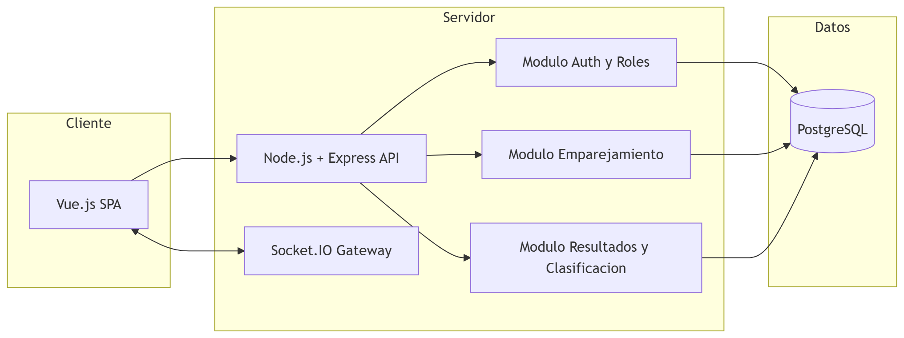

# Diagrama de componentes — Torre Central Hub

El diagrama de componentes de S4 ya existe en el documento de sustentación: [`docs/media/image10.png`](./media/image10.png) ("Componentes de arquitectura"). Este archivo no lo reemplaza — lo traduce a la estructura de carpetas real del código, para que ambos se lean juntos.

## Correspondencia entre el diagrama y el código

| Módulo del diagrama | Ubicación en el código | Responsabilidad |
|---|---|---|
| Vue.js SPA | `frontend/src/views`, `frontend/src/router`, `frontend/src/stores` | Pantallas por rol, navegación y estado (Pinia) |
| — (cliente HTTP/WS) | `frontend/src/services/api.ts`, `frontend/src/services/socket.ts` | Cliente axios hacia la API REST y cliente socket.io hacia el gateway |
| Node.js + Express API | `backend/src/app.ts`, `backend/src/routes` | Enrutamiento REST bajo `/api` |
| Socket.IO Gateway | `backend/src/sockets` | Emisión del catálogo de eventos en tiempo real |
| Modulo Auth y Roles | `backend/src/middlewares/auth.ts`, `backend/src/services/auth.service.ts`, `backend/src/services/tournamentAccess.ts` | HU01-03: registro, autenticación (JWT verificado contra la BD en cada petición), roles y permisos por torneo |
| Modulo Emparejamiento | `backend/src/services/pairing/`, `backend/src/services/rounds.service.ts` | HU08-09, HU28-29: motor suizo adaptado, bye, borrador, ajuste manual y publicación |
| Modulo Resultados y Clasificación | `backend/src/services/results.service.ts`, `backend/src/services/standings.*` | HU10-14: registro y corrección de resultados, recálculo de clasificación y desempates |
| — (consultas y documentos) | `backend/src/services/dashboard/`, `backend/src/services/tournamentStats.service.ts`, `backend/src/services/exports/` | HU15-16, HU30: paneles por rol, estadísticas del torneo y PDF oficiales |
| PostgreSQL | `backend/prisma/schema.prisma` | Persistencia según el modelo ER de S4 (ver más abajo) |

## Modelo ER (S4)

El modelo ER conceptual y el diagrama de clases de dominio ya están en el documento de sustentación:

- [`docs/media/image1.png`](./media/image1.png) — ER conceptual
- [`docs/media/image7.png`](./media/image7.png) — Clases de dominio
- [`docs/media/image8.png`](./media/image8.png) — Estados de torneo/ronda y ciclo de partida

`backend/prisma/schema.prisma` codifica ese modelo para PostgreSQL, con las 9 entidades del Objetivo específico 3 (Usuario, Rol, Jugador, Torneo, Ronda, Partida, Resultado, CriterioDesempate, Clasificacion). Dos decisiones de traducción de diagrama conceptual a esquema físico, documentadas también como comentarios en el propio `schema.prisma`:

- Los campos `estado` (tipados como `string` genérico en los diagramas) se refinan a enums de PostgreSQL (`UserStatus`, `TournamentStatus`, `RoundStatus`, `MatchStatus`; el código usa identificadores en inglés) con los mismos valores mostrados en `image8.png`, para integridad a nivel de base de datos.
- `Resultado` es una entidad 1:1 con `Partida` (relación "registra" del ER conceptual), no un catálogo compartido: cada partida decidida tiene su propia fila con la fecha de registro. El catálogo de valores válidos (RN-03) se aplica con un `CHECK` en la migración.

Las entidades que no estaban en el alcance de S4 se agregaron en su incremento: Inscripción (`Enrollment`), Club, vínculo entrenador-jugador (`CoachPlayer`), bitácora (`AuditLog`), solicitudes de datos (`DataRequest`) y paneles por rol (`RoleWidget`). Las migraciones están en `backend/prisma/migrations/` y se aplican con `npx prisma migrate dev`.

La arquitectura interna de cada capa, las decisiones de diseño y las mejoras aplicadas están en [`arquitectura.md`](./arquitectura.md).
